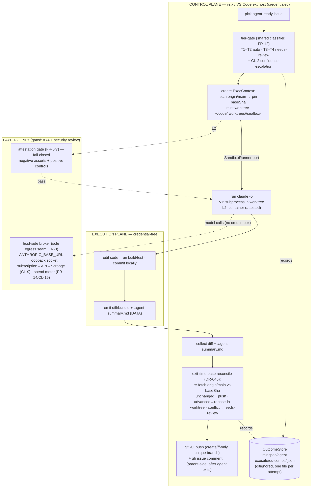

# Agent Execute — Layer-2 Execution Substrate — Design (Plan)

> Plan phase for [SPEC-019](./requirements.md). The requirements (FR-1..FR-16,
> INV-*, the Costly-to-Refactor list, CL-1..CL-15) are **binding**; this is the
> **HOW**. It encodes already-decided architecture — [DR-017](../../../docs/decisions/DR-017.md)
> (substrate), [DR-008](../../../docs/decisions/DR-008.md) (no-cred isolation),
> [DR-015](../../../docs/decisions/DR-015.md) (packaging), [DR-030](../../../docs/decisions/DR-030.md)
> (untrusted-as-data), [DR-004](../../../docs/decisions/DR-004.md) (tiering/air-gap),
> [DR-016](../../../docs/decisions/DR-016.md) (detect-or-degrade), [DR-046](../../../docs/decisions/DR-046.md)
> (rule-#8 worktree isolation + symmetric base-freshness) — and **re-decides
> nothing**. **No product code exists yet** (greenfield `packages/agent-execute`);
> this is the build plan, contracts-first.

## Approach

The build is **contracts-first, vertical-slice, ship-v1-then-gate-Layer-2**, in that
priority order — because the requirements' Costly-to-Refactor list is dominated by
**seams** (the two-plane split, the broker, the `SandboxRunner` port, the diff-handoff),
not by algorithms. Get the seam *shapes* frozen and the cheap-to-swap parts stay cheap.

1. **Freeze the ports before any runtime (contract-driven development).** Five TypeScript contracts —
   `SandboxRunner`, `OutcomeStore`, the broker resolution seam, the `AgentResult` Zod
   schema, and the discriminated `Result<T>` failure union — are authored and unit-tested
   against a **mock runner** first (FR-2: ~95% of the extension is testable with no docker
   daemon, which is also why CI for the control plane runs in this docker-less dev
   container). These are the expensive-to-reverse surfaces; everything behind them is an
   adapter.

2. **Ship v1 = manual Layer-1 (CL-1), no container.** `claude -p` runs as a **spawned
   subprocess** (never embedded in the ext host — FR-1 holds), in a **dedicated git
   worktree rooted outside every checkout** (DR-046), with the parent doing the
   `git push`/`gh issue comment` **after** the agent exits (FR-13 — the L1 subprocess holds
   no `gh`/push token). v1 is **not** egress-isolated (it shares the host `$HOME`/env);
   stripping that is the Layer-2 container's job. v1 is **trusted self-authored issues
   only** (FR-15, R2).

3. **Layer-2 is a follow-on milestone, gated.** The `DockerSandboxRunner` adapter, the
   host-side broker (FR-3/4/5), attestation (FR-6/7/8), and the FR-14 **spend** cap land
   after **OQ-1 (#74, subscription-oauth broker-injectability)** resolves *and* a dedicated
   security review passes. The contracts above are written so Layer-2 slots in **without
   touching control-plane callers** — the port is the only thing that knows docker exists.

4. **Every substrate seam is never-throw + typed-fallback (FR-11).** A thin shell
   `catch → log the reason → return { ok:false, reason }`; complex logic lives in inner
   functions that throw normally (real stack traces). Mirrors SPEC-016's discipline.

5. **Tier-0 air-gap is preserved by construction (FR-16).** All of this lives in
   `packages/agent-execute`. `packages/minspec` / `packages/shared` gain **no** dependency
   on it, the container runtime, the broker, or any network/AI module. The only shared code
   is a pure **type** (`Tier`, already in `@aiclarity/shared`); the classifier *engine* is
   consumed read-only (FR-12), not forked.

Ported **pure logic** (learn-functionality-only seeds, never adopted structure): the
`claude -p` invocation + `parseClaudeOutput`/`extractFixSummary` + verdict-ladder +
retry/confidence from `~/code/AgentSystem` (`dispatcher.js`/`result-handler.js`), and the
fetch-and-pin-base discipline demonstrated by this repo's dev-seed
[scripts/dispatch-issue.sh](../../../scripts/dispatch-issue.sh). The seeds' DB-queue/systemd
architecture is **not** adopted (requirements Out of scope).

## Architecture

Two planes (FR-1). v1 collapses the execution plane to a **subprocess + worktree** (no
container); Layer-2 swaps in the **container + attestation + broker** behind the same
`SandboxRunner` port. Nothing in the control plane changes across that swap.



**Boundary the diagram encodes (the invariants):** the agent process is only ever in the
execution plane (INV — agent-never-in-ext-host); in L2 the box holds no host cred and its
only egress is the broker socket (INV — no-cred/no-egress); the base is a *pinned SHA*, not
a live ref, and every parent git op is `git -C <worktree>` + explicit refspec with the
primary checkout verified unmoved before/after (INV — rule-#8; INV — symmetric
base-freshness).

## Module layout

`packages/agent-execute` (new Tier-1 package; ships in the Pro pack per DR-015).

| File | Status | Owns |
|---|---|---|
| `src/ports/sandbox-runner.ts` | new | `SandboxRunner` interface + `Result<T>`/`RunnerFailure` union (FR-2/FR-11). |
| `src/ports/outcome-store.ts` | new | `OutcomeStore` interface + `OutcomeRecord` (CL-4). |
| `src/runners/mock-runner.ts` | new | In-memory `SandboxRunner` for control-plane tests (FR-2/FR-8). |
| `src/runners/subprocess-runner.ts` | new | **v1** L1 adapter: `claude -p` subprocess in a worktree, no container. |
| `src/runners/docker-runner.ts` | **L2** | Container/devcontainer adapter behind the port (gated). |
| `src/git/exec-context.ts` | new | Fetch-and-pin base, mint/teardown worktree, primary-checkout verify (DR-046). Raw `execFile` git. |
| `src/git/reconcile.ts` | new | Exit-time re-fetch → rebase-in-worktree → ff-only push / fail-soft (DR-046). |
| `src/contracts/agent-result.ts` | new | `AgentResult` Zod schema (seed + batched) + rejectable-bundle predicate (CL-5). |
| `src/control/tier-gate.ts` | new | Consumes the shared classifier; T1–T2 auto / T3–T4 needs-review + CL-2 (FR-12). |
| `src/control/dispatch.ts` | new | Orchestrates create→run→collect→reconcile→push; retry-to-3 → `blocked` (CL-7). |
| `src/broker/*` | **L2** | Host-side broker, route resolution, spend meter (FR-3/4/5/14). |
| `src/attest/*` | **L2** | Probe manifest + verdict, fail-closed (FR-6/7/8). |
| `src/stores/file-outcome-store.ts` | new | v1 one-file-per-attempt JSON backend (SQLite is a v3 swap behind the port). |

New dependency: **`zod`** (1) — agent-output + outcome validation (the untrusted-output
trust boundary, CL-5). IDs via `node:crypto.randomUUID` (0 dep). Git via raw
`execFile`/`execFileSync` (0 dep; the explicit-refspec control the rule-#8 invariants
need). **Total new deps: 1**, inside the 2-3 complex-change budget.

## API

The frozen seams (contracts-first — these are the Costly-to-Refactor surfaces).

```ts
// Discriminated result — the never-throw currency (FR-11). The reason set is closed.
export type RunnerFailure =
  | 'no-runtime' | 'spawn-failed' | 'attest-failed' | 'timeout' | 'oom'
  | 'base-advanced' | 'base-advanced-conflict' | 'git-lock-contention' | 'checkout-moved';
export type Result<T> =
  | { ok: true; value: T }
  | { ok: false; reason: RunnerFailure; detail?: string };

// Pinned, isolated execution context (FR-13 base-ref + DR-046 worktree rules).
export interface ExecContext {
  readonly runId: string;     // crypto.randomUUID()
  readonly issue: number;
  readonly tier: Tier;        // from @aiclarity/shared — the only shared type (FR-16)
  readonly baseSha: string;   // immutable: `git rev-parse FETCH_HEAD` after a parent-side fetch
  readonly worktree: string;  // ~/code/.worktrees/<repo>/sealbox-<runId> — outside every checkout
  readonly branch: string;    // sealbox/<issue>-<runId> — per-dispatch-unique, never reused
}

// The substrate port (FR-2). v1 = SubprocessRunner; L2 = DockerSandboxRunner; tests = MockRunner.
export interface SandboxRunner {
  spawn(ctx: ExecContext): Promise<Result<Handle>>;
  attest(h: Handle): Promise<AttestationVerdict>;     // L1/mock: trivially-pass; L2: real probe
  run(h: Handle, prompt: AgentPrompt): Promise<Result<AgentRaw>>;
  collectDiff(h: Handle): Promise<Result<DiffBundle>>; // diff + .agent-summary.md, never a push
  teardown(h: Handle): Promise<void>;                  // worktree remove + temp-branch -D (finally/trap)
}

// Outcome/trust store (CL-4). One file per attempt → zero write contention by construction.
export interface OutcomeRecord {
  readonly runId: string; readonly issue: number; readonly tier: Tier;
  readonly baseSha: string; readonly attempt: 1 | 2 | 3;     // CL-7: 3 attempts → blocked
  readonly state: 'completed' | 'blocked' | 'cancelled';     // CL-7 terminal set
  readonly verdict?: AgentVerdict;                            // quality signal
  readonly failure?: RunnerFailure;                           // infra ≠ quality (CL-6): never tier-counts
  readonly startedAt: string; readonly endedAt: string;      // ISO-8601 UTC
}
export interface OutcomeStore {
  put(r: OutcomeRecord): Promise<void>;
  get(runId: string): Promise<OutcomeRecord | undefined>;
  list(): Promise<OutcomeRecord[]>;     // v1 = read-dir (cheap at v1–v2 volume)
}

// Agent-output contract (CL-5) — accepts the seed AND the nested/batched shape so no run
// silently null-fails. Validation at the trust boundary: agent output is untrusted DATA.
import { z } from 'zod';
const Confidence = z.number().min(0).max(1);
const AgentResultSeed = z.object({
  fix_description: z.string().min(1),
  confidence: Confidence,
  tests_passed: z.boolean(),
  files_changed: z.array(z.string()),
});
export const AgentResult = z.union([AgentResultSeed, z.object({ results: z.array(AgentResultSeed).min(1) })]);
// Rejectable bundle = empty diff | missing/empty summary | malformed-or-missing confidence | tests-failed.

// Broker resolution seam (FR-3/4/5, CL-9) — Layer-2. Single locus for model+effort+thinking
// AND credential precedence subscription → API → Scrooge (subscription-first even inside the
// Scrooge route, FR-5). The sandbox endpoint is fixed for all time; routing is a host-side flip.
export interface BrokerRoute {
  resolve(task: TaskSpec): { model: string; effort: Effort; thinking: Thinking };
}

// Spend cap (FR-14) — calendar daily + weekly, NOT a mirror of the 5h/7d subscription windows.
export interface SpendCapConfig { dailyUsd: number; weeklyUsd: number; } // seed daily = weekly/5 (editable)
export interface SpendMeter {            // the broker is the ONLY meter (CL-15)
  spentTodayUsd(): number;               // calendar-day window, resets local midnight
  spentThisWeekUsd(): number;            // calendar-week window, resets Monday
  // On wouldExceed → broker STOPS injecting PAYG and falls back to subscription-only
  // (throttle on the subscription window). Never hard-fails the dispatch (FR-10/11 posture).
  wouldExceed(estUsd: number): boolean;
}

// Attestation (FR-6/7) — Layer-2. Negative assertions + paired positive controls, fail-closed.
export interface AttestationVerdict {
  readonly pass: boolean;   // any should-be-denied capability that SUCCEEDS ⇒ false (fail-closed)
  readonly checks: ReadonlyArray<{
    readonly name: string;
    readonly denied: boolean;     // the deny-check failed inside the box, as it must
    readonly controlOk: boolean;  // its allowlisted positive control SUCCEEDED
    // denied=false ⇒ FAIL (capability leaked). denied=true & controlOk=false ⇒ FAIL (dead probe).
  }>;
}
```

## Data

**OutcomeStore record** — `.minspec/agent-execute/outcomes/<runId>.json`, gitignored,
Zod-validated, one file per attempt (CL-4). MinSpec core never reads this dir (FR-16).

| Field | Type | Notes |
|---|---|---|
| `runId` | string (uuid) | `crypto.randomUUID()`; also the worktree/branch suffix |
| `issue` | number | GitHub issue # |
| `tier` | `T1\|T2\|T3\|T4` | from the shared classifier over the spec (CL-8) |
| `baseSha` | string (40-hex) | pinned base (DR-046); travels onto the record + the agent's DATA caveat |
| `attempt` | `1\|2\|3` | 3 attempts → `blocked` (CL-7) |
| `state` | `completed\|blocked\|cancelled` | terminal set (CL-7) |
| `verdict` | `AgentVerdict?` | quality signal; absent on infra failure |
| `failure` | `RunnerFailure?` | infra failure — **never** counts against tier eligibility (CL-6) |
| `startedAt` / `endedAt` | string (ISO-8601 UTC) | lifecycle sweep uses these for soft/hard timeout reclaim (CL-7) |

**Spend meter** (Layer-2, FR-14) — two calendar windows the broker tallies:

| Window | Resets | Caps | On exceed |
|---|---|---|---|
| daily | local midnight | `dailyUsd` (runaway guard) | stop injecting PAYG → subscription-only |
| weekly | Monday 00:00 local | `weeklyUsd` (overage ceiling) | stop injecting PAYG → subscription-only |

## UX

Two control-plane surfaces. Every frequent action carries a keyboard path (RSI rule);
approval is a **non-modal toast over the visible artifact**, never a focus-stealing modal
(HITL UX). Both keyboard-reachable from the spec tree / command palette.

**(a) Spend-cap settings (FR-14)** — two dollar inputs + an honest derived ratio; **no**
behavioral 5h→7d multiplier (rejected — it baked an unstated working-pattern assumption):

```
┌─ Agent Execute · API-mode spend cap ────────────────────────────┐
│ Daily overage cap    [ $  20 ]                                   │
│ Weekly overage cap   [ $ 100 ]                                   │
│   → at your daily max you'd hit the weekly cap in 5 days         │
│     (weekly ÷ daily — describes what you set, not a behaviour)   │
│   ⚠ shown only when weekly ÷ daily < 5 (one bad day eats most    │
│      of the week)                                                │
│ Cap hit → fall back to subscription-only (never hard-fail).      │
│ Caps apply only in API/Scrooge mode; subscription default = none.│
└─────────────────────────────────────────────────────────────────┘
```

**(b) Tier-gated HITL — needs-review (FR-12)** — T3/T4 (or a CL-2 low-confidence T1/T2)
stop for human spec/plan approval before the agent starts:

```
┌─ Agent Execute · awaiting your approval ────────────────────────┐
│ #142  "Add rate-limit to webhook"            tier T3 · needs-review│
│ reason: T3 — Clarify+Plan approval required before dispatch       │
│ base pinned @ a1b2c3d   ·   self-authored ✓                       │
│   [Approve & dispatch ⏎]   [Open spec ^O]   [Skip ^S]            │
│ (agents you can trust because they stop)                          │
└─────────────────────────────────────────────────────────────────┘
```

## Build order (vertical slices, CDD)

Thinnest end-to-end path first, then widen — **not** all-ports-then-all-runtime.

1. **Slice 0 — contracts + mock.** Author the `## API` interfaces + `AgentResult` Zod;
   `MockRunner` + `FileOutcomeStore`; T0 invariant tests (never-throw shell, agent-never-in-
   ext-host static check, rule-#8 path assertions). No real dispatch yet.
2. **Slice 1 — one issue, end-to-end, L1.** Real `SubprocessRunner`: pin base → mint
   worktree → `claude -p` → collect diff + summary → reconcile (unchanged path) → parent
   `gh comment` + ff-only push → teardown. Single issue, happy path + primary failure (T2
   feature tests).
3. **Slice 2 — gate + retry + reconcile.** Tier-gate (auto vs needs-review) + CL-2; retry-
   to-3 → `blocked`; the **advanced** + **conflict** reconcile branches (DR-046); staleness
   re-check (CL-10).
4. **Slice 3 — caps + degrade.** Global concurrency cap (v1, CL-3); detect-or-degrade to L1
   when no runtime (FR-10/11); orphan/worktree GC (CL-7).
5. **Layer-2 milestone (gated).** `DockerSandboxRunner` + attestation (FR-6/7/8) + broker
   (FR-3/4/5) + the FR-14 **spend** cap + meter. Blocked on **#74** + security review.

## Out of scope (Plan)

Unchanged from [requirements §Out of scope](./requirements.md) — listed here only to mark
what the Plan deliberately does **not** schedule: microVM/gVisor + untrusted dispatch (#73);
remote/cloud substrate; the SPEC-016 reviewer (own spec, consumes this broker seam);
ScroogeLLM internals (DR-027); the `scripts/` dev-seed; the AgentSystem DB-queue/systemd
architecture; public brand name (#66, OQ-4). The Layer-2 build is **planned but gated**, not
out of scope.

## Open questions (carried, not re-decided here)

- **OQ-1 (#74) — subscription-oauth broker-injectability.** Empirical spike; **blocks the
  Layer-2 default-mode plumbing only**, not v1. Documented fallback: spawn-token injection /
  API-key mode (definitely injectable). Resolve in the Layer-2 milestone's security review.
- **OQ-2 (#73) — microVM/gVisor before untrusted dispatch.** Out of v1 and the v1 Layer-2
  milestone; v1 is trusted self-authored issues only.
- OQ-3 (packaging) — **resolved**: `packages/agent-execute` (DR-015). OQ-4 (public name) —
  deferred (#66).

## Traceability

FR/INV/CL → this Plan: ports (FR-2) → `## API` + Module layout; broker/billing/spend
(FR-3/4/5/14) → `## API` + `## Data` + `## UX`(a); attestation (FR-6/7/8) →
`AttestationVerdict` + Architecture L2 subgraph; mode split/degrade (FR-9/10/11) → Build
order 4 + `Result<T>`; HITL (FR-12) → `## UX`(b) + `tier-gate.ts`; diff-handoff + base
reconcile (FR-13, DR-046) → `## Architecture` + `git/exec-context.ts`/`git/reconcile.ts`;
untrusted-as-data (FR-15) → `AgentResult` validation + `<untrusted_…>` envelope; Tier-0
(FR-16) → Module layout (sole shared type = `Tier`).
