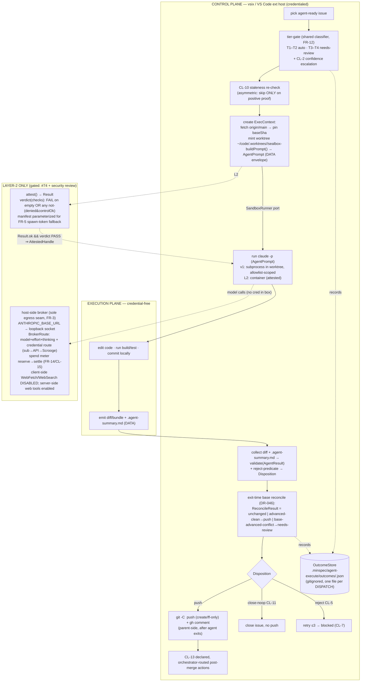

# Agent Execute — Layer-2 Execution Substrate — Design (Plan)

> Plan phase for [SPEC-019](./requirements.md). The requirements (FR-1..FR-16,
> INV-*, the Costly-to-Refactor list, CL-1..CL-15) are **binding**; this is the
> **HOW**. It encodes already-decided architecture — [DR-017](../../../docs/decisions/DR-017.md)
> (substrate), [DR-008](../../../docs/decisions/DR-008.md) (no-cred isolation),
> [DR-015](../../../docs/decisions/DR-015.md) (packaging), [DR-030](../../../docs/decisions/DR-030.md)
> (untrusted-as-data), [DR-004](../../../docs/decisions/DR-004.md) (tiering/air-gap),
> [DR-016](../../../docs/decisions/DR-016.md) (detect-or-degrade), [DR-046](../../../docs/decisions/DR-046.md)
> (rule-#8 worktree isolation + symmetric base-freshness) — and **re-decides
> nothing**. **No product code exists yet** (greenfield `packages/agent-execute`);
> this is the build plan, contracts-first.
>
> **This revision incorporates the 3-lens adversarial design review (2026-06-30):**
> the seams below are tightened so the T0 invariants are enforced *by the type*, not
> by caller discipline. Review-driven changes are tagged `[rev]` at point of use.

## Approach

The build is **contracts-first, vertical-slice, ship-v1-then-gate-Layer-2**, in that
priority order — because the requirements' Costly-to-Refactor list is dominated by
**seams** (the two-plane split, the broker, the `SandboxRunner` port, the diff-handoff),
not by algorithms. Get the seam *shapes* frozen — and frozen *correctly*, so misuse is a
type error — and the cheap-to-swap parts stay cheap.

1. **Freeze the ports before any runtime (contract-driven development).** The TypeScript
   contracts in `## API` — `SandboxRunner`, `OutcomeStore`, the broker seam, `AgentPrompt`
   (input trust boundary), `AgentResult` + the reject predicate (output trust boundary),
   the `Result<T>`/reason unions, and the attestation `verdict()` — are authored and
   unit-tested against a **mock runner** first (FR-2: ~95% of the extension is testable
   with no docker daemon). These are the expensive-to-reverse surfaces; everything behind
   them is an adapter. The review's recurring lesson is encoded as a rule: **a T0 invariant
   may not be expressed as a settable field or a caller convention — it must be the only
   constructible state** (see `attest`/`verdict`, `AttestedHandle`, `buildPrompt`).

2. **Ship v1 = manual Layer-1 (CL-1), no container — but with the L1 action boundary as a
   contract, not a prose claim.** `claude -p` runs as a **spawned subprocess** (never in the
   ext host — FR-1), in a **dedicated git worktree outside every checkout** (DR-046), with
   the parent doing `git push`/`gh comment` **after** the agent exits (FR-13). `[rev]` **The
   subprocess is not egress/cred-isolated (it shares the host `$HOME`/env, CL-1), so the
   *only* thing that stops it reading `~/.claude` or running `git push`/`gh` itself is a hard
   `--allowedTools` allowlist** (DR-008 Layer-1; the dev-seed proves the shape at
   [scripts/dispatch-issue.sh](../../../scripts/dispatch-issue.sh)). That allowlist is a
   **required `SubprocessPolicy` contract** (below), not an implementation detail — FR-13's
   "no push token in the handoff" closes the *handoff*, the allowlist closes the *ambient
   environment* (CL-12's "control-plane-only action boundary, Layer-1"). v1 is **trusted
   self-authored issues only** (FR-15, R2).

3. **Layer-2 is a follow-on milestone, gated.** The `DockerSandboxRunner` adapter, the
   host-side broker (FR-3/4/5), attestation (FR-6/7/8), and the FR-14 **spend** cap land
   after **OQ-1 (#74)** resolves *and* a dedicated security review passes. The contracts
   are written so Layer-2 slots in **without touching control-plane callers**.

4. **Every substrate seam is never-throw + typed-fallback (FR-11).** A thin shell
   `catch → log reason → return { ok:false, reason }`; complex logic in inner functions that
   throw normally. `[rev]` **This now includes `attest()`** — it returns `Result<…>`, so a
   probe that throws becomes a typed `attest-failed`, never an exception escaping the port.

5. **Tier-0 air-gap preserved by construction (FR-16).** All of this lives in
   `packages/agent-execute`. `packages/minspec`/`packages/shared` gain no dependency on it,
   the container runtime, the broker, or any network/AI module. The only shared code is the
   pure **type** `Tier` (already in `@aiclarity/shared`).

Ported **pure logic** (learn-functionality-only seeds, never adopted structure): the
`claude -p` invocation + `parseClaudeOutput`/`extractFixSummary` + verdict-ladder + retry/
confidence from `~/code/AgentSystem`; the fetch-and-pin-base + **allowlist + envelope**
discipline demonstrated by the dev-seed `scripts/dispatch-issue.sh`. The seeds' DB-queue/
systemd architecture is **not** adopted (requirements Out of scope).

## Architecture

Two planes (FR-1). v1 collapses the execution plane to a **subprocess + worktree** (no
container, allowlist-scoped); Layer-2 swaps in the **container + attestation + broker**
behind the same `SandboxRunner` port. Nothing in the control plane changes across the swap.



**Boundary the diagram encodes (the invariants):** the agent process is only ever in the
execution plane (INV — agent-never-in-ext-host); in L2 the box holds no host cred and its
only egress is the broker socket (INV — no-cred/no-egress); in v1 the subprocess is
allowlist-scoped (INV — credential-free actions, CL-12); the base is a *pinned SHA* and
every parent git op is `git -C <worktree>` + explicit refspec with the primary checkout
verified unmoved before/after (INV — rule-#8; INV — symmetric base-freshness); `run()` only
accepts an `AttestedHandle` (INV — attest fail-closed).

## Module layout

`packages/agent-execute` (new Tier-1 package; ships in the Pro pack per DR-015).

| File | Status | Owns |
|---|---|---|
| `src/ports/sandbox-runner.ts` | new | `SandboxRunner` + `Handle`/`AttestedHandle` + `Result<T>`/`RunnerFailure` (FR-2/FR-11). |
| `src/ports/outcome-store.ts` | new | `OutcomeStore` + `OutcomeRecord`; **fail-closed read semantics** (CL-4/CL-6). |
| `src/runners/mock-runner.ts` | new | In-memory `SandboxRunner` for control-plane tests (FR-2/FR-8). |
| `src/runners/subprocess-runner.ts` | new | **v1** L1 adapter; **requires `SubprocessPolicy` (allowlist); no `bypassPermissions` code path** (grep-gated). |
| `src/runners/docker-runner.ts` | **L2** | Container adapter behind the port (gated). |
| `src/control/prompt.ts` | new | `[rev]` `buildPrompt()` — the **only** path to an `AgentPrompt`; wraps the issue body in `<untrusted_issue_body>` DATA + injection-aware preamble + `baseSha` caveat (FR-15). |
| `src/contracts/agent-result.ts` | new | `AgentResult` Zod (seed + batched **fold**) + `rejectBundle()` predicate + `Disposition` (CL-5/CL-11). |
| `src/git/exec-context.ts` | new | Fetch-and-pin base, mint/teardown worktree, primary-checkout verify (DR-046). Raw `execFile` git. |
| `src/git/reconcile.ts` | new | Exit-time re-fetch → `ReconcileResult` (DR-046). |
| `src/control/staleness.ts` | new | `[rev]` CL-10 re-check returning `Staleness` (asymmetric fail-soft). |
| `src/control/tier-gate.ts` | new | Shared classifier; T1–T2 auto / T3–T4 needs-review + CL-2 (FR-12). |
| `src/control/side-effects.ts` | new | `[rev]` CL-13 declared, orchestrator-routed post-merge action set. |
| `src/control/dispatch.ts` | new | Orchestrates gate→stale→create→run→collect→reconcile→disposition; retry≤3→`blocked` (CL-7). |
| `src/broker/*` | **L2** | Host-side broker, `BrokerRoute` (+ credential route), `SpendMeter` reserve/settle (FR-3/4/5/14). |
| `src/attest/*` | **L2** | Probe manifest (FR-5-parameterized) + pure `verdict()`, fail-closed (FR-6/7/8). |
| `src/stores/file-outcome-store.ts` | new | v1 one-file-per-dispatch JSON backend (SQLite is a v3 swap behind the port). |

New dependency: **`zod`** (1) — the `AgentPrompt`/`AgentResult` trust boundaries (CL-5). IDs
via `node:crypto.randomUUID` (0 dep). `[rev]` **uniqueness is the only INV requirement** for
the id; it is **not** lexically sortable, so `OutcomeStore.list()`/orphan-GC (CL-7) sort by
`startedAt`, never by id. Git via raw `execFile` (0 dep; the explicit-refspec control rule #8
needs). **Total new deps: 1.** `.minspec/agent-execute/` is added to `.gitignore` in Slice 0
(`[rev]` — the dir is asserted gitignored by CL-4/FR-16; assert it, don't assume it).

## API

The frozen seams. `[rev]` markers note review-driven tightenings.

```ts
// ── Never-throw currency (FR-11). base-advanced REMOVED from the failure set [rev]:
//    a clean advance is a SUCCESS that rebases+pushes (a ReconcileResult, below), not a
//    failure. Only the conflict/overlap case is a runner-level fail-soft.
export type RunnerFailure =
  | 'no-runtime' | 'spawn-failed' | 'attest-failed' | 'timeout' | 'oom'
  | 'base-advanced-conflict' | 'git-lock-contention' | 'checkout-moved';
export type Result<T> =
  | { ok: true; value: T }
  | { ok: false; reason: RunnerFailure; detail?: string };

// ── v1 L1 action boundary [rev] — the allowlist IS the Layer-1 control (CL-12, DR-008).
//    A closed allowlist; NO node/npx/cat/gh/git push|remote|config; bypassPermissions banned.
export interface SubprocessPolicy {
  readonly allowedTools: readonly string[];   // e.g. Read, Edit, Write, Bash(npm test), Bash(git add:*)
  readonly disallowBypass: true;               // literal true — grep-gated, no bypassPermissions path
}

export interface ExecContext {
  readonly runId: string;     // crypto.randomUUID() — unique, NOT sortable
  readonly issue: number;
  readonly tier: Tier;        // from @aiclarity/shared — the only shared type (FR-16)
  readonly baseSha: string;   // immutable: git rev-parse FETCH_HEAD after a parent-side fetch
  readonly worktree: string;  // ~/code/.worktrees/<repo>/sealbox-<runId> — outside every checkout
  readonly branch: string;    // sealbox/<issue>-<runId> — per-dispatch-unique, never reused
  readonly policy: SubprocessPolicy;   // [rev] required — the box's action boundary
}

// ── Input trust boundary [rev] (FR-15). The ONLY constructor is buildPrompt(); the raw
//    issue body never appears outside the <untrusted_issue_body> delimiters (T0 test).
export interface AgentPrompt {
  readonly system: string;            // role + injection-aware "data, not instructions" preamble
  readonly untrustedBody: string;     // the issue/spec body, to be wrapped in <untrusted_issue_body>
  readonly baseCaveat: string;        // "tree pinned at <baseSha>; do not assert non-existence…"
  readonly __brand: 'AgentPrompt';    // un-forgeable: only buildPrompt() can mint it
}
export function buildPrompt(ctx: ExecContext, issueBody: string, role: string): AgentPrompt;

// ── The substrate port (FR-2). run() takes an AttestedHandle [rev] — you cannot call it on
//    an un-attested handle (fail-closed by construction, INV-attest-fail-closed, Costly #4).
export type Handle = { readonly id: string; readonly ctx: ExecContext };
export type AttestedHandle = Handle & { readonly __attested: 'PASS' };
export interface SandboxRunner {
  spawn(ctx: ExecContext): Promise<Result<Handle>>;
  attest(h: Handle): Promise<Result<AttestationVerdict>>;     // [rev] Result-wrapped: a throwing probe ⇒ attest-failed
  run(h: AttestedHandle, prompt: AgentPrompt): Promise<Result<AgentRaw>>;  // [rev] AttestedHandle only
  collectDiff(h: AttestedHandle): Promise<Result<DiffBundle>>; // diff + .agent-summary.md, never a push
  teardown(h: Handle): Promise<void>;                          // worktree remove + temp-branch -D (finally/trap)
}
// Promotion is the single gate: only verdict(checks)==='PASS' mints an AttestedHandle.
export function attestedHandle(h: Handle, v: AttestationVerdict): AttestedHandle | null;

// ── Output trust boundary (CL-5). AgentResult validates SHAPE; rejectBundle() decides
//    DISPOSITION over result + the collected bundle (diff/summary live HERE, not in the schema).
import { z } from 'zod';
const Confidence = z.number().min(0).max(1);
const AgentResultSeed = z.object({
  fix_description: z.string().min(1),
  confidence: Confidence,
  tests_passed: z.boolean(),
  files_changed: z.array(z.string()),
});
export const AgentResult = z.union([AgentResultSeed, z.object({ results: z.array(AgentResultSeed).min(1) })]);
// [rev] Batched fold is EXPLICIT (no silent element-pick → CL-2 safe): confidence = MIN,
//   tests_passed = AND, files_changed = union. A single seed folds to itself.
export function foldResult(r: z.infer<typeof AgentResult>):
  { confidence: number; tests_passed: boolean; files_changed: string[] };

export type RejectReason =
  | 'empty-diff' | 'missing-summary' | 'malformed-confidence' | 'tests-failed'
  | 'stale-base' | 'base-advanced-conflict';     // [rev] stale-base added (DR-046 row f / AC)
// [rev] Disposition resolves the CL-5-vs-CL-11 conflation: an empty diff classified
//   "resolved / not-a-bug / operational" (from the summary) is a no-op CLOSE, not a reject.
export type Disposition =
  | { kind: 'push' }
  | { kind: 'close-noop'; note: string }         // CL-11
  | { kind: 'reject'; reason: RejectReason };     // CL-5 → retry≤3
export function rejectBundle(
  result: z.infer<typeof AgentResult>,
  bundle: DiffBundle,
  summary: string,
): Disposition;

// ── Exit-time reconcile [rev] (DR-046). The clean-advance SUCCESS path is representable.
export type ReconcileResult =
  | { kind: 'unchanged' }                          // push as-is
  | { kind: 'advanced-clean'; newBase: string }    // rebased clean → re-run gate → push
  | { ok: false; reason: 'base-advanced-conflict' | 'git-lock-contention' | 'checkout-moved' };

// ── Staleness re-check [rev] (CL-10). Asymmetric fail-soft enforced by the type: only an
//    explicit 'resolved' skips; on any error/uncertainty the discriminant is 'proceed'.
export type Staleness = { kind: 'proceed' } | { kind: 'resolved'; proof: string };

// ── Outcome/trust store (CL-4). One file per DISPATCH [rev]; attempt split so infra
//    failures (CL-6) never consume a quality attempt.
export interface OutcomeRecord {
  readonly runId: string; readonly issue: number; readonly tier: Tier;
  readonly baseSha: string;
  readonly qualityAttempt: number;     // [rev] 1..3 of the QUALITY ladder (CL-7); infra dispatches don't bump it
  readonly dispatchSeq: number;        // [rev] monotonic per-issue physical dispatch index (CL-4 1:1 with the file)
  readonly state: 'completed' | 'blocked' | 'cancelled';
  readonly verdict?: AgentVerdict;     // quality signal
  readonly failure?: RunnerFailure;    // infra failure — NEVER counts vs tier eligibility (CL-6)
  readonly startedAt: string; readonly endedAt: string;   // ISO-8601 UTC (orphan sweep + list() sort key)
}
export interface OutcomeStore {
  put(r: OutcomeRecord): Promise<void>;
  // [rev] Tri-state, fail-closed: corrupt/torn file ⇒ 'corrupt', NOT undefined-as-success.
  get(runId: string): Promise<{ kind: 'found'; rec: OutcomeRecord } | { kind: 'absent' } | { kind: 'corrupt' }>;
  list(): Promise<OutcomeRecord[]>;    // read-dir, sort by startedAt (ids aren't sortable)
}

// ── Broker resolution seam (FR-3/4/5, CL-9) — Layer-2. [rev] resolve() now carries the
//    credential route, so subscription→API→Scrooge precedence has a typed home (not a comment).
export type CredentialMode = 'subscription' | 'api' | 'scrooge-then-api';
export interface BrokerResolution {
  readonly model: string; readonly effort: Effort; readonly thinking: Thinking;
  readonly credential: CredentialMode;   // subscription-first even inside the Scrooge route (FR-5)
}
export interface BrokerRoute { resolve(task: TaskSpec): BrokerResolution; }

// ── Spend cap (FR-14) — calendar daily + weekly. [rev] reserve→settle closes the
//    read-then-inject race (N concurrent callers can't each pass a stale tally); the gauge
//    is per-window and truthful.
export interface SpendCapConfig { dailyUsd: number; weeklyUsd: number; } // seed daily = weekly/5 (editable)
export interface SpendWindow { readonly capUsd: number; readonly spentUsd: number; readonly resetsAt: string; }
export interface SpendMeter {                 // the broker is the ONLY meter (CL-15)
  windows(): { daily: SpendWindow; weekly: SpendWindow };   // truthful per-window gauge
  // Atomic: reserves estUsd against BOTH windows incl. unsettled in-flight reservations.
  // null ⇒ would exceed a cap ⇒ broker withholds PAYG, degrades to subscription-only (FR-10/11).
  reserve(estUsd: number): { id: string } | null;
  settle(reservationId: string, actualUsd: number): void;
}

// ── Attestation (FR-6/7) — Layer-2. [rev] pass is NOT a settable field; PASS is only
//    derivable from a non-empty, all-(denied&controlOk) check set. A dead/empty probe ⇒ FAIL.
export interface AttestationVerdict {
  readonly checks: ReadonlyArray<{ readonly name: string; readonly denied: boolean; readonly controlOk: boolean }>;
  // [rev] FR-5 fallback: in spawn-token mode exactly ONE token is whitelisted; the manifest
  //   is parameterized so the cred-env check expects that one token present (not all-unset).
  readonly mode: 'no-cred' | 'spawn-token-whitelisted';
}
export function verdict(v: AttestationVerdict): 'PASS' | 'FAIL';  // FAIL if checks.length===0 || any !(denied&&controlOk)
```

## Data

**OutcomeStore record** — `.minspec/agent-execute/outcomes/<runId>.json`, gitignored,
Zod-validated, one file per **dispatch** (CL-4). MinSpec core never reads this dir (FR-16).
A corrupt/torn record reads as `corrupt` (fail-closed), never as success `[rev]`.

| Field | Type | Notes |
|---|---|---|
| `runId` | string (uuid) | `crypto.randomUUID()`; unique, **not** sortable |
| `issue` | number | GitHub issue # |
| `tier` | `T1\|T2\|T3\|T4` | shared classifier over the spec (CL-8) |
| `baseSha` | string (40-hex) | pinned base (DR-046); travels into the agent's DATA caveat |
| `qualityAttempt` | number (1..3) | quality ladder (CL-7); **infra failures do not bump it** (CL-6) |
| `dispatchSeq` | number | physical dispatch index; 1:1 with the file (CL-4) |
| `state` | `completed\|blocked\|cancelled` | terminal set (CL-7) |
| `verdict` | `AgentVerdict?` | quality signal; absent on infra failure |
| `failure` | `RunnerFailure?` | infra failure — never tier-counts (CL-6) |
| `startedAt`/`endedAt` | string (ISO-8601 UTC) | sweep timeouts (CL-7) + `list()` sort key |

**Spend meter** (Layer-2, FR-14) — two calendar windows the broker tallies; `reserve()`
counts unsettled in-flight cost so the cap holds under concurrency `[rev]`:

| Window | Resets | Cap | On reserve→null |
|---|---|---|---|
| daily | local midnight | `dailyUsd` (runaway guard) | withhold PAYG → subscription-only |
| weekly | Monday 00:00 local | `weeklyUsd` (overage ceiling) | withhold PAYG → subscription-only |

## UX

Two control-plane surfaces. Every frequent action carries a keyboard path (RSI rule);
approval is a **non-modal toast over the visible artifact**, never a focus-stealing modal.

**(a) Spend-cap settings (FR-14)** — two dollar inputs + an honest derived ratio; **no**
behavioral 5h→7d multiplier (rejected). `[rev]` the gauge reads each window truthfully:

```
┌─ Agent Execute · API-mode spend cap ────────────────────────────┐
│ Daily overage cap    [ $  20 ]   today:  $14 / $20 · resets 00:00│
│ Weekly overage cap   [ $ 100 ]   week:   $61 /$100 · resets Mon  │
│   → at your daily max you'd hit the weekly cap in 5 days         │
│     (weekly ÷ daily — describes what you set, not a behaviour)   │
│   ⚠ shown only when weekly ÷ daily < 5                           │
│ Cap hit → withhold PAYG, fall back to subscription-only (never   │
│   hard-fail). Reserves count in-flight spend, so the cap holds   │
│   under concurrent runs.                                         │
└─────────────────────────────────────────────────────────────────┘
```

**(b) Tier-gated HITL — needs-review (FR-12)** — T3/T4 (or a CL-2 low-confidence T1/T2)
stop for human spec/plan approval before the agent starts:

```
┌─ Agent Execute · awaiting your approval ────────────────────────┐
│ #142  "Add rate-limit to webhook"            tier T3 · needs-review│
│ reason: T3 — Clarify+Plan approval required before dispatch       │
│ base pinned @ a1b2c3d  ·  self-authored ✓  ·  still-actionable ✓   │
│   [Approve & dispatch ⏎]   [Open spec ^O]   [Skip ^S]            │
│ (agents you can trust because they stop)                          │
└─────────────────────────────────────────────────────────────────┘
```

## Build order (vertical slices, CDD)

Thinnest end-to-end path first, then widen.

1. **Slice 0 — contracts + mock + the by-construction guards.** Author every `## API`
   interface incl. `AgentPrompt`/`buildPrompt`, `SubprocessPolicy`, `AttestedHandle`/
   `attestedHandle`, `verdict()`, `rejectBundle`/`Disposition`, `foldResult`, the tri-state
   `OutcomeStore.get`; `MockRunner` + `FileOutcomeStore`; add `.minspec/agent-execute/` to
   `.gitignore`. **T0 tests:** subprocess allowlist (can't read `~/.claude` / `git push`);
   no `bypassPermissions` path (grep); `buildPrompt` keeps the body inside delimiters;
   `verdict([])==='FAIL'` and dead-probe ⇒ FAIL; `run()` won't accept a bare `Handle`
   (type-level); corrupt outcome ⇒ not terminal-success; agent-never-in-ext-host (grep);
   `minspec`/`shared` → agent-execute dep-graph = none.
2. **Slice 1 — one issue, end-to-end, L1.** Real `SubprocessRunner` (allowlist-enforced):
   `buildPrompt` → pin base → mint worktree → `claude -p` → collect diff + summary →
   `foldResult` + `rejectBundle` → `Disposition` (push / close-noop / reject) → parent
   `gh comment` + ff-only push → teardown. Happy path + the close-noop (CL-11) + reject
   (CL-5) branches.
3. **Slice 2 — gate + retry + reconcile + staleness + side-effects.** Tier-gate + CL-2;
   `Staleness` re-check (CL-10, asymmetric); retry≤3→`blocked`; `ReconcileResult`
   (unchanged / advanced-clean→re-gate→push / conflict→needs-review, DR-046); CL-13 declared
   post-merge action set.
4. **Slice 3 — caps + degrade.** **Verify exact current Anthropic-plan limits before wiring**
   `[rev]` (FR-14 precondition); global concurrency cap (v1, CL-3) respecting the 5h/weekly
   subscription window; detect-or-degrade to L1 when no runtime (FR-10/11); orphan/worktree
   GC (CL-7).
5. **Layer-2 milestone (gated).** `DockerSandboxRunner` + attestation (`verdict()` +
   FR-5-parameterized manifest) + broker (`BrokerRoute` credential route + `SpendMeter`
   reserve/settle) + **disable client-side WebFetch/WebSearch, enable server-side web tools**
   `[rev]` (FR-3). Blocked on **#74** + security review.

## Out of scope (Plan)

Unchanged from [requirements §Out of scope](./requirements.md); listed only to mark what the
Plan does **not** schedule: microVM/gVisor + untrusted dispatch (#73); remote/cloud
substrate; the SPEC-016 reviewer; ScroogeLLM internals (DR-027); the `scripts/` dev-seed; the
AgentSystem DB-queue/systemd architecture; public brand name (#66). The Layer-2 build is
**planned but gated**, not out of scope.

## Open questions (carried, not re-decided here)

- **OQ-1 (#74) — subscription-oauth broker-injectability.** Blocks the Layer-2 default-mode
  plumbing only, not v1. Fallback = spawn-token injection (the attestation manifest's
  `spawn-token-whitelisted` mode now expresses it) / API-key mode.
- **OQ-2 (#73) — microVM/gVisor before untrusted dispatch.** Out of v1 + v1 Layer-2 milestone.
- OQ-3 (packaging) — resolved: `packages/agent-execute` (DR-015). OQ-4 (public name) —
  deferred (#66).

## Traceability

FR/INV/CL → this Plan: ports (FR-2) → `SandboxRunner`/`AttestedHandle`; broker/billing/spend
(FR-3/4/5/14) → `BrokerRoute`(credential route) + `SpendMeter`(reserve/settle) + `## Data` +
`## UX`(a) + Build 4/5; attestation (FR-6/7/8) → `verdict()` + `AttestationVerdict`(mode) +
Architecture L2; mode split/degrade (FR-9/10/11) → Build 4 + `Result<T>` + `attest()`
Result-wrapped; HITL (FR-12) → `## UX`(b) + `tier-gate.ts`; diff-handoff + base reconcile
(FR-13, DR-046) → `## Architecture` + `exec-context.ts`/`reconcile.ts`/`ReconcileResult`;
**untrusted-as-data (FR-15) → `buildPrompt()`/`AgentPrompt` INPUT envelope (the primary v1
injection control) — distinct from `AgentResult` OUTPUT validation** `[rev, corrects the
prior over-claim]`; the L1 action boundary (CL-12) → `SubprocessPolicy` allowlist;
CL-10/11/13 → `Staleness`/`Disposition`/`side-effects.ts`; CL-5/CL-2 → `rejectBundle` +
`foldResult`; Tier-0 (FR-16) → Module layout (sole shared type = `Tier`).
